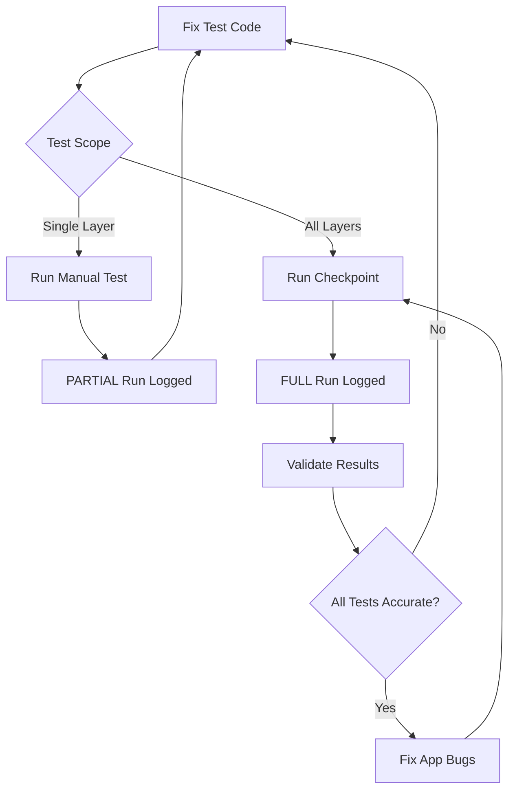

# Checkpoint Testing System

## Overview
The checkpoint system tracks E2E test quality over time with a two-file structure:
1. **checkpoint-history.csv** - Summary metrics (tracked in git)
2. **checkpoint-TIMESTAMP.json** - Detailed results (git-ignored)

## Quick Reference

### File Structure
```
e2e/checkpoints/
├── checkpoint-history.csv              # 📊 One row per test run
├── checkpoint-2025-10-22T17-28-37.json # 📋 Detailed results (git-ignored)
└── checkpoint-2025-10-21T22-30-26.json # 📋 Previous run (git-ignored)
```

### Column Reference

| Column | Description | Example |
|--------|-------------|---------|
| `timestamp` | When test ran | `2025-10-22T17:28:37.551Z` |
| `run_type` | FULL or PARTIAL | `FULL` |
| `total_layers_tested` | # of layers tested | `45` |
| `feature_services_tested` | # of FeatureServices | `39` |
| `image_services_tested` | # of ImageServices | `6` |
| `true_positives` | Tests correctly passing | `46` |
| `true_negatives` | Tests correctly failing | `3` |
| `false_positives` | Tests incorrectly passing | `2` |
| `false_negatives` | Tests incorrectly failing | `9` |
| `overall_accuracy` | (TP+TN)/Total | `81.7%` |
| `passing_services` | # of services passing all tests | `38` |
| `failing_services` | # of services with failures | `7` |
| `failing_service_names` | List if ≤5, else reference | `"Cattle Guards; Dibblee Geology; ..."` |
| `detailed_results_file` | JSON filename | `checkpoint-2025-10-22T17-28-37.json` |

## Workflow

### Development (Refining Tests)
```bash
# Test specific layer
npx playwright test e2e/tnc-arcgis-layers/calfire-frap-fire-threat-2019.spec.ts

# Run partial tests (marks as PARTIAL in history)
npx playwright test --grep="CalFire" --config=playwright.checkpoint.config.ts
```

### Checkpoint (After Major Changes)
```bash
# Full test run (marks as FULL in history)
npm run test:e2e:checkpoint

# Validate test accuracy
npm run test:e2e:validate

# View progress over time
npm run test:e2e:progress
```

## Run Types

### FULL Run
- Tests **all 45 categorized layers**
- Automatically saved to `checkpoint-history.csv`
- Marked as `FULL` in `run_type` column
- Use for official checkpoints to track progress

### PARTIAL Run
- Tests **subset of layers** (e.g., manual test, debugging)
- **NOT saved to `checkpoint-history.csv`**
- JSON file created for manual review only
- Use for refining individual tests before full checkpoint

## Analysis Tips

### In Excel/Google Sheets:
1. **All rows are FULL runs** - no filtering needed!

2. **Track progress:**
   - Plot `overall_accuracy` over time (column J)
   - Plot `failing_services` over time (column L - should decrease)
   - Plot `true_positives` over time (column F - should increase)

3. **Identify problem layers:**
   - Check `failing_service_names` column (M)
   - Open referenced JSON file (column N) for detailed breakdown

### Example Chart:
- X-axis: `timestamp` (column A)
- Y-axis: `overall_accuracy` (column J)
- Watch it trend upward as tests improve! 📈

## Design Rationale

### Why NOT Track PARTIAL Runs in CSV?
- **Signal vs Noise**: Only FULL runs are true checkpoints
- **Clean History**: No filtering needed - every row is meaningful
- **Progress Tracking**: Pure trend data without manual test noise
- **Simplicity**: Open CSV = instant progress visualization

### What About PARTIAL Run Data?
- **JSON Snapshots**: Every run (FULL or PARTIAL) creates a JSON file
- **Manual Review**: PARTIAL run JSONs available for debugging
- **Detailed Analysis**: Check detailed results when refining specific tests
- **Git-Ignored**: JSON files don't clutter git history

### Why CSV + JSON?
- **CSV**: Human-readable, spreadsheet-compatible, git-friendly (small)
- **JSON**: Detailed debugging, programmatic access, git-ignored (large)
- **Best of Both**: Quick trends in CSV, deep dive in JSON

## Examples

### Scenario: Refining a Single Layer
```bash
# 1. Run tests on one layer
npx playwright test --grep="Cattle Guards" --config=playwright.checkpoint.config.ts
```

**Result:**
- **Console output**: Shows PARTIAL run stats (not saved to CSV)
- **JSON file created**: `checkpoint-2025-10-22T10-00-00-000Z.json`
- **CSV**: No change (PARTIAL runs not tracked)

### Scenario: Official Checkpoint
```bash
# 2. After fixing tests, run full checkpoint
npm run test:e2e:checkpoint
```

**Result in history:**
```csv
2025-10-22T16:00:00Z, FULL, 45, 39, 6, 52, 3, 0, 5, 91.7%, 41, 4, "Cattle Guards; Coastal...", ...
```

### Scenario: Tracking Progress
Open `checkpoint-history.csv` in Excel:
1. **No filtering needed** - all rows are FULL runs!
2. Create chart: X-axis = timestamp (column A), Y-axis = overall_accuracy (column J)
3. Celebrate as accuracy climbs from 72% → 81% → 92% 🎉
4. Watch `failing_services` (column L) decrease over time

## Integration with Workflow



## Goals

### Short-term (Testing Phase)
- Eliminate all False Positives (tests too lenient)
- Eliminate all False Negatives (tests too strict)
- Achieve 100% test accuracy (TP + TN = 100%)

### Long-term (Production)
- Fix app bugs to improve service quality
- Track `failing_services` decreasing over time
- Maintain high test accuracy as new features are added
- Use as regression detection system

## Commit Message Template

When restructuring checkpoint system:
```
refactor(e2e): enhance checkpoint history with run type and metadata

- Add run_type column (FULL/PARTIAL) to distinguish checkpoint runs
- Add layer counts (total, FeatureServices, ImageServices)
- Track both full checkpoints and partial test runs
- Enable filtering by run type in spreadsheets

Benefits:
- Clear distinction between official checkpoints and debugging runs
- Better progress tracking with layer type breakdowns
- Complete audit trail of all test activity
- Easy to filter for trend analysis

Files changed:
- e2e/reporters/checkpoint-reporter.ts: Enhanced statistics
- e2e/README.md: Document new structure
- e2e/CHECKPOINT_SYSTEM.md: Quick reference guide
```
